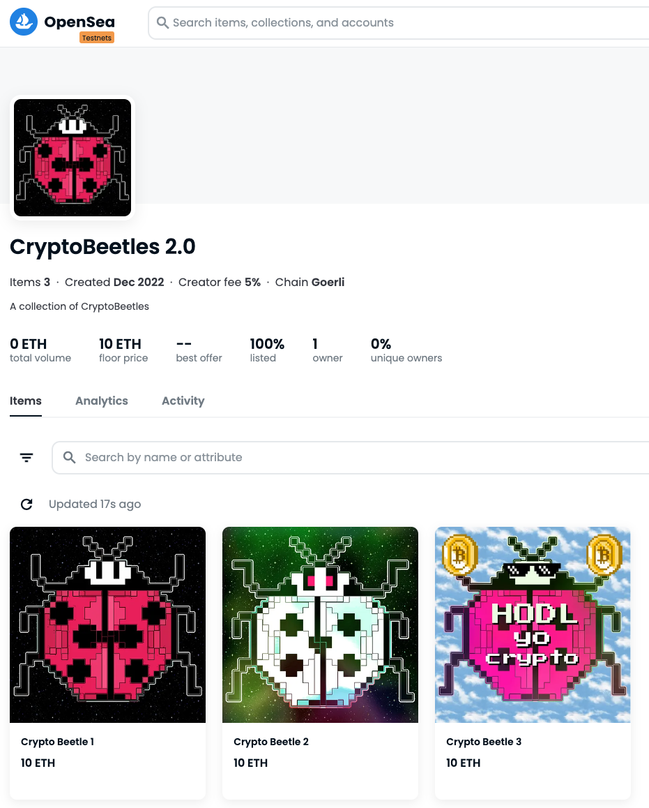

# CryptoBeetles 2.0 - ERC-721 NFT Collection

- NFT collection deployed to the Goerli ETH Testnet @ [0x91E057dc30973a317910367d4487a20f55421E0a](https://goerli.etherscan.io/address/0x91e057dc30973a317910367d4487a20f55421e0a).
- Listed for sale on [OpenSea Testnet](https://testnets.opensea.io/collection/cryptobeetles-jo9j1bgz6o).
- Leverages: [OpenZeppelins ERC721 library](https://docs.openzeppelin.com/contracts/2.x/api/token/erc721).
- NFT metadata published on IPFS. 
- Deployed using [Hardhat](https://hardhat.org/).
- Contains dedicated `deploy.js` & `mint.js` scripts. 
   

